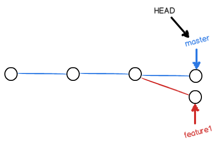
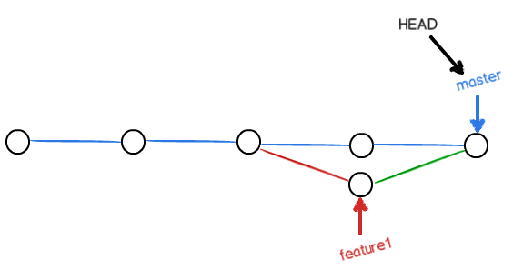
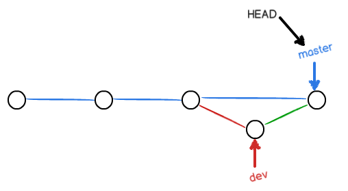
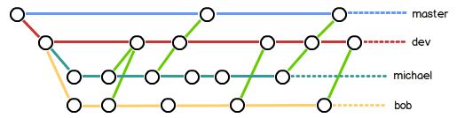

# GitLearn

* ```shell
  $ git init
  ```
  将当前目录初始化为git可以管理的仓库。

* ```shell
  $ git add <文件名>
  ```
  讲文件或更改文件添加到暂存区。

* ```shell
  $ git commit -m "提交描述"
  ```
  将暂存区内容提交至仓库分支（默认为主分支（master））。

* ```shell
  $ git status
  ```
  该命令可以让我们时刻掌握仓库当前的状态。比如有文件被修改等，但是不能看到具体修改内容。

* ```shell
  $ git diff <文件名>
  ```
  查看文件修改内容（在git add之前调用有效)

* ```shell
  $ git log [--pretty=oneline] 
  ```
  查看提交记录，【】中参数为每个记录显示一行。

* ```shell
  $ git reset --hard HEAD^
  ```
  * 回到上一个版本。**版本回退**
  * HEAD代表当前版本，HEAD^代表前一个版本，HEAD^^代表前第二个版本，，，。 HEAD～100前第一百个版本。
  * 撤回到最新版本的方法：
    * 如果命令窗口还存在提交的命令，可以找到提交时的commit id ，可以这样恢复：
      ```shell
      $ git add readme.md
      $ git commit -m "append GPL"
      [master 3628164] append GPL
       1 file changed, 1 insertion(+), 1 deletion(-)
       -----------------------------------------------------
      $ git reset --hard 3628164
      ```
    * ```shell
      $ git reflog
      ```
      该命令将显示所以操作记录，如下：
      ```shell
      $ git reflog
      ea34578 HEAD@{0}: reset: moving to HEAD^
      3628164 HEAD@{1}: commit: append GPL
      ea34578 HEAD@{2}: commit: add distributed
      cb926e7 HEAD@{3}: commit (initial): wrote a readme file
      ```
      然后再通过`$ git reset --hard <commit id>`进行恢复。

* ```shell
  git checkout -- <文件名>
  ```
  该命令意思是，把某文件在工作区的修改全部撤销，这
  里有两种情况：
  * 一种是某文件自修改后还没有被放到暂存区，现在，撤销修改就回到和版本库一模一样的状态；
  * 一种是某文件已添加到暂存区后，又做了修改，现在，撤销修改就回到添加到暂存区后的状态。
  * 总之，就是让这个文件回到最后一次`$ git commit`或者`$ git add`时的状态。
  * 该命令中的 -- 很重要，没有 -- ，就变成了“切换到另一个分支”的命令，我们后面的分支管理中会再次遇到`$ git checkout`命令。

* ```shell
  $ git reset HEAD <文件名>
  ```
  该命令可以把暂存区的修改撤销掉（unstage），重新放回工作区：
  ```shell
  $ git reset HEAD readme.txt
  Unstaged changes after reset:
  M       readme.txt
  ```

* ####修改内容总结
  * 场景1：当你改乱了工作区某个文件的内容，想直接丢弃工作区的修改时：
    * ```shell
      $ git checkout -- <file name>
      ```
  * 场景2：当你不但改乱了工作区某个文件的内容，还添加到了暂存区时，想丢弃修改，分两步，第一步使用命令
    * ```shell
      git reset HEAD <file name> //回退到场景1
      ```
    * 第二步按场景1操作。
  * 场景3：已经提交了不合适的修改到版本库时，想要撤销本次提交，必须进行版本回退。前提是：没有推送到远程库。

* ####删除文件
  * 工作区文件删除:`$ rm filename`

    * 版本库删除:`$ git rm filename`

    * ​
      提交更改:`$ git commit -m "删除描述"`
      ---
  * 撤销文件删除
    * ```shell
      $ rm filename
      ```
    * ```shell
      $ git checkout -- filename
      ```
  * 注释：git checkout 其实是用版本库里的版本替换工作区的版本，无论工作区是修改还是删除，都可以“一键还原”。

* ####生成ssh key
  由于你的本地git仓库和github仓库之间的传输是通过ssh加密的，所以需要生成并设置秘钥。
  * 生成秘钥：
  ```shell
  $ ssh-keygen -t rsa -C "youremail@example.com"
  ```
  ​	你需要把邮件地址换成你自己的邮件地址，然后一路回车，使用默认值即可，由于这个Key也不是用于军事目的，所以也无需设置密码。

  ​	如果一切顺利的话，可以在用户主目录里找到`.ssh`目录，里面有`id_rsa`和`id_rsa.pub`两个文件，这两个就是SSH Key的秘钥对，`id_rsa`是私钥，不能泄露出去，`id_rsa.pub`是公钥，可以放心地告诉任何人。
  * 设置秘钥
    ​	将`id_rsa.pub`文件中的内容设置到`github`账号的`SSH Keys` 。

    ​	为什么GitHub需要SSH Key呢？因为GitHub需要识别出你推送的提交确实是你推送的，而不是别人冒充的，而Git支持SSH协议，所以，GitHub只要知道了你的公钥，就可以确认只有你自己才能推送。

* ####git本地仓库与github仓库关联
  创建github仓库
  * 创建本地仓库并关联github仓库
    ```shell
    $ echo "# learngit" >> README.md
    $ git init
    $ git add README.md
    $ git commit -m "first commit"
    $ git remote add origin https://github.com/ShawnFeiyu/learngit.git
    $ git push -u origin master
    ```
  * 关联本地仓库到github仓库
    ```shell
    $ git remote add origin https://github.com/ShawnFeiyu/learngit.git
    $ git push -u origin master
    ```
    ​        把本地库的内容推送到远程，用`git push`命令，实际上是把当前分支`master`推送到远程。
    ​        由于远程库是空的，我们第一次推送`master`分支时，加上了`-u`参数，Git不但会把本地的`master`分支内容推送到远程新的`master`分支，还会把本地的`master`分支和远程的`master`分支关联起来，在以后的推送或者拉取时就可以简化命令了：
  ```shell
  $ git push origin master
  ```
  ​        推送成功后，可以立刻在Github页面中看到远程库的内容已经和本地一模一样。

* ####从远程库克隆
  ```shell
  $ git clone https://github.com/ShawnFeiyu/learngit.git
  ```
  该命令直接将仓库下载下来，即文件夹learngit。

* ####git修改远程仓库地址
  方法有三中：
  * 修改命令
    ```shell
    $ git remote set-url origin [url]
    Eg.
    $ git remote set-url origin git@github.com:ShawnFeiyu/learngit.git
    ```
  * 先删后加
    ```shell
    $ git remote rm origin
    $ git remote add origin [url]
    ```
  * 直接修改config文件

* ####远程仓库总结
  git支持多种协议，包括https，但通过ssh支持的元素git协议速度最快。
  ***SSH警告待解决***。

* ####分支管理

  > 分支在实际中有什么用呢？假设你准备开发一个新功能，但是需要两周才能完成，第一周你写了50%的代码，如果立刻提交，由于代码没写完，不完整的代码库会导致别人不能干活了。如果等代码全部写完再一次提交，又存在丢失每天进度的巨大风险。


  > 现在有了分支，就不用怕了。你创建了一个属于自己的分支，别人看不到，还继续在原来的分支上正常工作，而你在自己的分支上干活，想提交就提交，直到开发完毕后，再一次性合并到原来的分支上，这样既安全，又不影响别人工作。


  > 其他版本控制系统如SVN等都有分支管理，但是用过了之后你会发现，这些版本控制系统创建和切换分支比蜗牛还慢，简直让人无法忍受，结果分之功能成了摆设，大家都不去用。


  > 但git的分支是与众不同的，无论创建、切换和删除分支，git在1秒钟之内就能完成！无论你的版本库是1个文件还是1万个文件。

  在版本回退里，你已经知道，每次提交，git都把它们串成一条时间线，这条时间线就是一个分支。截止到目前，只有一条时间线，在git里，这个分支叫主分支，即`master`分支。`HEAD`才是指向提交的，所以，`HEAD`指向的就是当前分支。

  一开始的时候，`master`分支是一条线，git用`master`指向最新的提交，再用`HEAD`指向`master`，就能确定当前分支，以及当前分支的提交点：

  

  每次提交，`master`分支都会向前移动一步，这样，随着你不断提交，`master`分支的线也越来越长。

  当我们创建新的分支，例如`dev	`时，git新建了一个指针叫`dev`，指向`master`相同的提交，再把`HEAD`指向`dev`，就表示当前分支在`dev`上：

  

  你看，git创建一个分支很快，因为除了增加一个`dev`指针，改改`HEAD`的指向，工作区的文件都没有任何变化！

  不过，从现在开始，对工作区的修改和提交就是针对`dev`分支了，比如新提交一次后，`dev`指针往前移动一步，而`master`指针不变：

  

  假如我们在`dev`上的工作完成了，就可以把`dev`合并到`master`上。git怎么合并呢？最简单的方法，就是直接把`master`指向`dev`的当前提交，就完成了合并：

  

  所以git合并分支也很快！就改改指针，工作区内容也不变！

  合并完分支后，甚至可以删除`dev`分支。删除`dev`分支就是把`dev`指针删掉，删掉后，我们就剩下了一条`master`分支：

  

*   创建分支

    ```shell
    $ git checkout -b dev
    Switched to a new branch 'dev'
    ```

    `git checkout`命令加上`-b`参数表示创建并切换，相当于以下两条命令：

    ```shell
    $ git branch dev
    $ git checkout dev
    Switched to branch 'dev'
    ```

    然后，用`git branch`命令查看当前分支：

    ```shell
    $git branch
    * dev
      master
    ```

    `git branch`命令会列出所有分支，当前分之前会标一个`*`号。

    然后，我们就可以在`dev`分支上正常提交，比如对readme.md做个修改，加上一行：

    ```shell
    Creating a new branch is quick.
    ```

    然后提交：

    ```shell
    $ git add readme.txt 
    $ git commit -m "branch test"
    [dev fec145a] branch test
     1 file changed, 1 insertion(+)
    ```

    现在，`dev`分支的工作完成，我们就可以切换回`master`分支：

    ```shell
    $ git checkout master
    Switched to branch 'master'
    ```

    切换回`master`分支后，再查看一个readme.md文件，刚才添加的内容不见了！因为那个提交是在`dev`分支上，而`master`分支此刻的提交点并没有变：

    

    * 合并分支

  现在，我们把`dev`分支的工作成果合并到`master`分支上：

```shell
  $ git merge dev
  Updating d17efd8..fec145a
  Fast-forward
   readme.txt |    1 +
   1 file changed, 1 insertion(+)
```

  `git merge`命令用于合并指定分支到当前分支。合并后，再查看readme.md的内容，就可以看到了，和`dev`分支的最新提交是完全一样的。

  注意到上面的`Fast-forward`信息，git告诉我们，这次合并是“快进模式”，也就是直接把`master`指向`dev`的当前提交，所以合并速度非常快。

  当然，也不是每次合并都能`Fast-forward`，我们后面会讲其他方式的合并。

  合并完成后，就可以放心地删除`dev`分支了：

```shell
  $ git branch -d dev
  Deleted branch dev (was fec145a).
```

  删除后，查看`branch`，就剩下`master`分支了：

```shell
  $ git branch
  * master
```

  因为创建、合并和删除分支非常快，所以git鼓励你使用分支完成某个任务，合并后再删掉分支，这和直接在`master`分支上工作效果是一样的，但过程更加安全。

*   ##### 总结

    查看分支：`git branch`

    创建分支：`git branch <name>`

    切换分支：`git checkout <name>`

    创建+切换分支：`git checkout -b <name>`

    合并某分支到当前分支：`git merge <name>`

    删除分支：`git branch -d <name>`

*   分支冲突解决

      人生不如意之事十之八九，合并分支往往也不是一帆风顺的。

      准备新的`feature1`分支，继续我们的新分支开发：

    ```shell
      $ git checkout -b feature1
      Switched to a new branck 'feature1'
    ```

      修改readme.md最后一行，改为：

      ```
      Creating a new branch is quick AND simple.
      ```

      在`feature1`分支上提交：

    ```shell
      $ git add readme.md
      $ git commit -m "AND simple"
      [feature1 b3ff9c8] branch new test
       1 file changed, 1 insertion(+), 1 deletion(-)
    ```

      切换到`master`分支：

    ```shell
      $ git checkout master
      切换到分支 'master'
      您的分支与上游分支 'origin/master' 一致。
    ```

      git还会自动提示我们当前`master`分支与远程的`master`分支一致。

      在`master`分支上把readme.md文件的最后一行改为：

      ```
      Creating a new branch is quick & simple.
      ```

      提交：

    ```shell
      $ git add readMe.md 
      $ git commit -m "& simple"
      [master ba786c8] & simple
       1 file changed, 1 insertion(+), 1 deletion(-)
    ```

      现在，`master`分支和`feature1`分支各自都分别有了新的提交，变成了这样：

      

      在这种情况下，git无法执行“快速合并”，只能试图把各自的修改合并起来，但这种合并就可能会有冲突，我们试试看：

    ```shell
      $ git merge feature1 
      自动合并 readMe.md
      冲突（内容）：合并冲突于 readMe.md
      自动合并失败，修正冲突然后提交修正的结果。
    ```

      果然冲突了！git告诉我们，readme.md文件存在冲突，必须手动解决提交。`git status`也可以告诉我们冲突的文件：

    ```shell
      $ git status
      位于分支 master
      您的分支领先 'origin/master' 共 1 个提交。
        （使用 "git push" 来发布您的本地提交）
      您有尚未合并的路径。
        （解决冲突并运行 "git commit"）
        （使用 "git merge --abort" 终止合并）

      未合并的路径：
        （使用 "git add <文件>..." 标记解决方案）

      	双方修改：   readMe.md

      修改尚未加入提交（使用 "git add" 和/或 "git commit -a"）
    ```

    * ```shell
      git merge --abort （终止合并）
      ```

    我们也可以直接查看readme.md的内容：

    ```shell
    # 龙飞的传奇  

    * git的尝试

    * 龙的传奇

    * command

      > 梯子好
      >
      > My stupid boss still prefers SVN.  
    <<<<<<< HEAD
      > Creating a new branch is quick & simple.
    =======
      > Creating a new branch is quick AND simple.
    >>>>>>> feature1
    ```

    git用`<<<<<<<`，`=======`，`>>>>>>>`标记出不同分支的内容，我们修改如下后保存：

    ```shell
    Creating a new branch is quick and simple.
    ```

    再提交：

    ```shell
    $ git add readme.md
    $ git commit -m "conflict fixed"
    [master dcdce3c] conflict fixed
    ```

    现在，`master`分支和`feature1`分支变成了下图所示：

    

    用带参数的`git log`也可以看到分支的合并情况：

    ```shell
    $ git log --graph --pretty=oneline --abbrev-commit
    *   dcdce3c conflict fixed
    |\  
    | * b3ff9c8 AND simple
    * | ba786c8 & simple
    |/  
    * 4392081 branch test
    * f2ff8e1 修改origin后测试
    * 27f25a7 远程服务器联系
    * 819ee43 add test.md
    * 16d8b0f 添加文件
    * 3032375 第二次提交
    * 3de6081 第一次尝试
    ```

    最后，删除`feature1`分支:

    ```shell
    $ git branch -d feature1 
    已删除分支 feature1（曾为 b3ff9c8）。
    ```

    工作完成。

    * 小结

      当git无法自动合并分支时，就必须首先解决冲突。解决冲突后，再提交，合并完成。

      用`git log --graph`命令可以看到分支合并图。

*   分支管理策略

      通常，合并分支时，如果可能，git会用`Fast forward`模式，但这种模式下，删除分支后，会丢掉分支信息。

      如果要强制禁用`Fast forward`模式，git就会在merge时生成一个新的commit，这样，从分支历史上就可以看出分支信息。

      下面我们实战一下  `--no-ff` 方式的 `git merge`:

      首先，仍然创建并切换`dev`分支:

    ```shell
      $ git checkout -b dev
      Switched to a new branch 'dev'
    ```

      修改readme.md文件，并提交一个新的commit:

    ```shell
      $ git add readMe.md
      $ git commit -m "add merge"
      [dev 690313c] add merge
       1 file changed, 1 insertion(+)
    ```

      现在，我们切换回`master`:

    ```shell
      $ git checkout master
      Switched to branch 'master'
      Your branch is up-to-date with 'origin/master'.
    ```

      准备合并`dev`分支，请注意`--no-ff`参数，表示禁用`Fast forward`:

    ```shell
      $ git merge --no-ff -m "merge with no-ff" dev
      Merge made by the 'recursive' strategy.
       readMe.md | 1 +
       1 file changed, 1 insertion(+)
    ```

      因为本次合并要创建一个新的commit，所以加上`-m`参数，把commit描述写进去。

      合并后，我们用`git log`看看分支历史：

    ```shell
      $ git log --graph --pretty=oneline --abbrev-commit
    *   d24be3d (HEAD -> master) merge with no-ff
    |\
    | * 690313c (dev) add merge
    |/
    * a4fbff2 (origin/master, origin/HEAD) windows first
    * 797314d .
    ······
    ```

    我们可以看到，不适用`Fast forward`，merge后就像这样:

    

    **分支策略**

    在实际开发中，我们应该按照几个基本原则进行分支管理:

    首先，`master`分支应该是非常稳定的，也就是仅用来发布新版本，平时不能在上面干活；

    那在哪里干活呢？干活都在`dev`分支上，也就是说，`dev`分支是不稳定的，到某个时候，比如1.0版本发布时，再把`dev`分支合并到`master`上，在`master`分支发布1.0版本；

    你和你的小伙伴们每个人都在`dev`分支上干活，每个人都有自己的分支，时不时地往`dev`分支上合并就可以了。

    所以，团队合作的分支看起来就像这样:

    

    * 小结

      git分支十分强大，在团队开发中应该充分应用。

      合并分支时，加上`--no-ff`参数就可以用普通模式合并，合并后的历史有分支，能看出来曾经做过合并，而`fast forward`合并就看不出来曾经做过合并。

*   Bug分支

      软件开发中，bug就像家常便饭一样。有了bug就需要修复，在git中，由于分支是如此的强大，所以，每个bug都可以通过一个新的临时分支来修复，修复后，合并分支，然后将临时分支删除。

      当你接到一个修复一个代号101的bug的任务时，很自然地，你想创建一个分支`issue-101`来修复它，但是，等等，当前`dev`进行的共工作还没有提交：

    ```shell
      $ git status
      # On branch dev
      # Changes to be committed:
      #   (use "git reset HEAD <file>..." to unstage)
      #
      #       new file:   hello.py
      #
      # Changes not staged for commit:
      #   (use "git add <file>..." to update what will be committed)
      #   (use "git checkout -- <file>..." to discard changes in working directory)
      #
      #       modified:   readme.txt
      #
    ```

      并不是你不想提交，而是工作只进行到一半，还没发提交，预计完成还需1天时间。但是，必须在两个小时内修复bug，怎么办？

      幸好，git还提供了一个`stash`功能，可以把当前工作现场“存储”起来，等以后恢复现场后继续工作：

    ```shell
      $ git stash
      Saved working directory and index state WIP on dev: 6224937 add merge
      HEAD is now at 6224937 add merge
    ```

      现在，用`git status`查看工作区，就是干净的（除非有没有被git管理的文件），因此可以放心地创建分支来修复bug。

      首先，确定要在那个分支上修复bug，假定需要在`master`分支上修复，就在`master`创建临时分支：

    ```shell
      $ git checkout master
      Switched to branch 'master'
      Your branch is ahead of 'origin/master' by 6 commits.
      $ git checkout -b issue-101
      Switched to a new branch 'issue-101'
    ```

      现在修复bug，需要把`git is free software,,,`修改为`git is a free software,,,`，修改完后提交：

    ```shell
      $ git add readme.txt 
      $ git commit -m "fix bug 101"
      [issue-101 cc17032] fix bug 101
       1 file changed, 1 insertion(+), 1 deletion(-)
    ```

      修复完成后，切换到`master`分支，并完成合并，最后删除`issue-101`分支：

    ```shell
      $ git checkout master
      Switched to branch 'master'
      Your branch is ahead of 'origin/master' by 2 commits.
      $ git merge --no-ff -m "merged bug fix 101" issue-101
      Merge made by the 'recursive' strategy.
       readme.txt |    2 +-
       1 file changed, 1 insertion(+), 1 deletion(-)
      $ git branch -d issue-101
      Deleted branch issue-101 (was cc17032).
    ```

      太棒了，原计划两个小时的bug修复只花了5分钟！现在，是时候接着回到`dev`分支干活了！

    ```shell
      $ git checkout dev
      Switched to branch 'dev'
      $ git status
      # On branch dev
      nothing to commit (working directory clean)
    ```

      工作区是干净的，刚才的工作现场存到哪里去了？用`git stash list`命令查看：

    ```shell
      $ git stash list
      stash@{0}: WIP on dev: 6224937 add merge
    ```

      工作现场还在，git把stash内容存在某个地方了，但是需要回复一下，有两个办法：

      一是用`git stash apply`恢复，但是恢复后，`stash`内容并不删除，你需要用`git stash drop`来删除；

      另一种方式是用`git stash pop`，恢复的同时把`stash`内容也删了：

    ```shell
      $ git stash pop
      # On branch dev
      # Changes to be committed:
      #   (use "git reset HEAD <file>..." to unstage)
      #
      #       new file:   hello.py
      #
      # Changes not staged for commit:
      #   (use "git add <file>..." to update what will be committed)
      #   (use "git checkout -- <file>..." to discard changes in working directory)
      #
      #       modified:   readme.txt
      #
      Dropped refs/stash@{0} (f624f8e5f082f2df2bed8a4e09c12fd2943bdd40)
    ```

      再用`git stash list`查看，就看不到任何`stash`内容了：

    ```shell
      $ git stash list
    ```

      你可以多次`stash`，恢复的时候，先用`git stash list`查看，然后恢复指定的`stash`，用命令:

    ```shell
      $ git stash apply stash@{0}
    ```

    * **小结**

      修复`bug`时，我们会通过创建新的`bug`分支进行修复，然后合并，最后删除；

      当手头工作没有完成时，先把工作现场`git stash`一下，然后去修复`bug`，再`git stash pop`，回到工作现场。

    * Feature分支

      软件开发中，总有无穷无尽的新功能要不断添加进来。

      添加一个新功能时，你肯定不希望因为一些实验性质的代码，把主分支搞乱了，所以，每添加一个新功能，最好新建一个`feature`分支，在上面开发，完成后，合并，最后，删除该`feature`分支。

      现在，你终于接到了一个新任务：开发代号为Vulcan的新功能，该功能计划用于下一代星际飞船。

      于是准备开始：

      ```shell
      $ git checkout -b feature-valcan
      Switched to a new branch 'feature-valcan'
      ```

      5分钟后，开发完毕：

      ```shell
      $ git add vulcan.py
      $ git status
      # On branch feature-vulcan
      # Changes to be committed:
      #   (use "git reset HEAD <file>..." to unstage)
      #
      #       new file:   vulcan.py
      #
      $ git commit -m "add feature vulcan"
      [feature-vulcan 756d4af] add feature vulcan
       1 file changed, 2 insertions(+)
       create mode 100644 vulcan.py
      ```

      切换`dev`，准备合并:

      ```shell
      $ gti checkout dev
      ```

      一切顺利的话，feature分支和bug分支是类似的，合并，然后删除。

      但是，

      就在此时，接到上级命令，因经费不足，新功能必须取消!

      虽然白干了，但是这个分支还是必须就地销毁:

      ```shell
      $ git branch -d feature-vulcan
      error: The branch 'feature-vulcan' is not fully merged.
      If you are sure you want to delete it, run 'git branch -D feature-vulcan'.
      ```

      销毁失败。git友情提醒，`feature-vulcan`分支还没有被合并，如果删除，将丢失修改，如果要强行删除，需要使用命令`git branch -D feature-vulcan`。

      现在我们强行删除：

      ```shell
      $ git branch -D feature-vulcan
      Deleted branch feature-vulcan (was 756d4af).
      ```

      终于删除成功!

      * **小结**

        开发一个新`feature`，最好新建一个分支；

        如果要丢弃一个没有被合并过的分支，可以通过`git branch -D <branch name>`强行删除。

*   多人协作

      当你从远程仓库克隆时，实际上git自动把本地的`master`分支和远程的`master`分支对应起来了，并且，远程仓库的默认名称是`origin`。

      要查看远程库的信息，用`git remote`:

    ```shell
      $ git remote
      origin
    ```

      或者，用`git remote -v`显示更详细的信息：

    ```shell
      $ git remote -v
      origin  git@github.com:ShawnFeiyu/learngit.git (fetch)
      origin  git@github.com:ShawnFeiyu/learngit.git (push)
    ```

      上面显示了可以抓取和推送的`origin`的地址。如果没有推送权限，就看不到，就看不到push的地址。

      ### 推送分支

      推送分支，就是把该分支上的所有本地提交推送到远程库。推送时，要指定本地分支，这样，git就会把该分支推送到远程库对于的分支上：

    ```shell
      $ git push origin master
    ```

      如果要推送其他分支，比如`dev`，就改成：

    ```shell
      $ git push origin dev
    ```

      但是，并不是一定要把本地分支往远程推送，那么，哪些分支需要推送，哪些不需要呢？

    * `master`分支是主分支，因此要时刻与远程同步；
    * `dev`分支是开发分支，团队所有成员都需要在上面工作，所以也需要与远程同步；
    * `bug`分支只用于在本地修复bug，就没必要推送到远程了，除非老板要看看你每周到底修复了几个bug；
    * feature分支是否推到远程，取决于你是否和你的小伙伴合作在上面开发。

    总之，就是在git中，分支完全可以在本地自己藏着玩，是否推送，视你的心情而定！

    ### 抓取分支

    多人协作时，大家都会往`master`和`dev`分支上推送各自的修改。

    现在，模拟一个你的小伙伴，可以在另一台电脑（注意要把ssh key添加到github）或者同一台电脑的另一个目录下克隆：

    ```shell
    $ git clone git@github.com:michaelliao/learngit.git
    Cloning into 'learngit'...
    remote: Counting objects: 46, done.
    remote: Compressing objects: 100% (26/26), done.
    remote: Total 46 (delta 16), reused 45 (delta 15)
    Receiving objects: 100% (46/46), 15.69 KiB | 6 KiB/s, done.
    Resolving deltas: 100% (16/16), done.
    ```

    当你的小伙伴从远程库`clone`时，默认情况下，你的小伙伴只能看到本地的`master`分支。不信可以用`git branch`命令查看:

    ```shell
    $ git branch
    * master
    ```

    现在，你的小伙伴要在`dev`分支上开发，就必须创建远程`origin`的`dev`分支到本地，于是他用这个命令创建本地`dev`分支：

    ```shell
    $ git checkout -b dev origin/dev
    ```

    现在，他就可以在`dev`上继续修改，然后，时不时地把`dev`分支`push`到远程：

    ```shell
    $ git commit -m "add /usr/bin/env"
    [dev 291bea8] add /usr/bin/env
     1 file changed, 1 insertion(+)
    $ git push origin dev
    Counting objects: 5, done.
    Delta compression using up to 4 threads.
    Compressing objects: 100% (2/2), done.
    Writing objects: 100% (3/3), 349 bytes, done.
    Total 3 (delta 0), reused 0 (delta 0)
    To git@github.com:michaelliao/learngit.git
       fc38031..291bea8  dev -> dev
    ```

    你的小伙伴已经向`origin/dev`分支推送了他的提交，而碰巧你也对同样的文件坐了修改，并试图推送：

    ```shell
    $ git add hello.py 
    $ git commit -m "add coding: utf-8"
    [dev bd6ae48] add coding: utf-8
     1 file changed, 1 insertion(+)
    $ git push origin dev
    To git@github.com:michaelliao/learngit.git
     ! [rejected]        dev -> dev (non-fast-forward)
    error: failed to push some refs to 'git@github.com:michaelliao/learngit.git'
    hint: Updates were rejected because the tip of your current branch is behind
    hint: its remote counterpart. Merge the remote changes (e.g. 'git pull')
    hint: before pushing again.
    hint: See the 'Note about fast-forwards' in 'git push --help' for details.
    ```

    推送失败，因为你的小伙伴的最新提交和你试图推送的提交有冲突，解决办法也很简单，git已经提示我们，先用`git pull`把最新的提交从`origin/dev`抓下来，然后，在本地合并，解决冲突，再推送：

    ```shell
    $ git pull
    remote: Counting objects: 5, done.
    remote: Compressing objects: 100% (2/2), done.
    remote: Total 3 (delta 0), reused 3 (delta 0)
    Unpacking objects: 100% (3/3), done.
    From github.com:michaelliao/learngit
       fc38031..291bea8  dev        -> origin/dev
    There is no tracking information for the current branch.
    Please specify which branch you want to merge with.
    See git-pull(1) for details

        git pull <remote> <branch>

    If you wish to set tracking information for this branch you can do so with:

        git branch --set-upstream dev origin/<branch>
    ```

    `git pull`也失败了，原因是没有指定本地`dev`分支与远程`origin/dev`分支的链接，根据提示，设置`dev`和`origin/dev`分支的链接，根据提示，设置`dev`和`origin/dev`的链接：

    ```shell
    $ git branch --set-upstream dev origin/dev
    Branch dev set up to track remote branch dev from origin.
    ```

    再pull:

    ```shell
    $ git pull
    Auto-merging hello.py
    CONFLICT (content): Merge conflict in hello.py
    Automatic merge failed; fix conflicts and then commit the result.
    ```

    这回`git pull `成功，但是合并有冲突，需要手动解决，解决的方法和分支管理中的**解决冲突**完全一样。解决后，提交，再push：

    ```shell
    $ git commit -m "merge & fix hello.py"
    [dev adca45d] merge & fix hello.py
    $ git push origin dev
    Counting objects: 10, done.
    Delta compression using up to 4 threads.
    Compressing objects: 100% (5/5), done.
    Writing objects: 100% (6/6), 747 bytes, done.
    Total 6 (delta 0), reused 0 (delta 0)
    To git@github.com:michaelliao/learngit.git
       291bea8..adca45d  dev -> dev
    ```

    因此，多人协作的工作模式通常是这样：

    1. 首先，可以试图用`git push origin branch-name`推送自己的修改；
    2. 如果推送失败，则因为远程分支比你的本地更新，需要用`git pull`试图合并；
    3. 如果合并有冲突，则解决冲突，并在本地提交；
    4. 没有冲突或者解决掉冲突后，再用`git push origin branch-name`推送就能成功！

    如果`git pull`提示“no tracking information”，则说明本地分支和远程分支的链接关系没有创建，用命令`git branch --set-upstream branch-name origin/branch-name`。

    这就是多人协作模式，一旦熟悉了，就非常简单。

    ## 小结

    * 查看远程库信息，使用`git remote -v`;
    * 本地新建的分支如果不推送到远程，对其他人就是不可见的；
    * 从本地推送分支，使用`git push origin branch-name`，如果推送失败，先用`git pull`抓取远程的新提交；
    * 在本地创建和远程分支对应的分支，使用`git checkout -b branch-name origin/branch-name`，本地和远程分支的名称最好一致；
    * 建立本地分支与远程分支的关联，使用`git branch --set-upstream branch-name origin/branch-name`；
    * 从远程抓取分支，使用`git pull`，如果有冲突，要先处理冲突。

*   ####标签管理

    发布一个版本时，我们通常先在版本库中打一个标签（tag），这样，就唯一确定了打标签时刻的版本。将来无论什么时候，取某个标签的版本，就是把那个打标签的时刻的历史版本取出来。所以，标签也是版本库的一个快照。

    git的标签虽然是版本库的快照，但其实它就是指向某个committee的指针（跟分支很像对不对？但是分支可以移动，标签不能移动），所以，创建和删除标签都是瞬间完成的。

    git有commit，为什么还要引入tag？

    “请把上周一的那个版本打包发布，commit号是6a5819e...”

    “一串乱七八糟的数字不好找！”

    如果换一个办法：

    “请把上一周的那个版本打包发布，版本号是v1.2”

    “好的，按照tag v1.2查找commit就行！”

    所以，tag就是一个让人容易记住的有意义的名字，它跟某个commit绑定在一起。

    * 创建标签

      在git中打标签非常简单，首先，切换要打标签的分支上：

      ```shell
      $ git branch
      * dev
        master
      $ git checkout master
      Switched to branch 'master'
      ```

      然后，敲命令`git tag <name>`就可以打一个新标签：

      ```shell
      $ git tag v1.0
      ```

      可以用命令`git tag`查看所有标签：

      ```shell
      $ git tag
      v1.0
      ```

      默认标签是打在最新提交的commit上的。有时候，如果忘了打标签，比如，现在已经是周五了，但应该在周一打的标签没有打，怎么办？

      方法是找到历史提交的commit id，然后打上就可以了：

      ```shell
      $ git log --pretty=oneline --abbrev-commit
      6a5819e merged bug fix 101
      cc17032 fix bug 101
      7825a50 merge with no-ff
      6224937 add merge
      59bc1cb conflict fixed
      400b400 & simple
      75a857c AND simple
      fec145a branch test
      d17efd8 remove test.txt
      ...
      ```

      比方说要对`add merge`这次提交打标签，它对应的`commit id`是：6224937，敲命令：

      ```shell
      $ git tag v0.9 6224937
      ```

      再用命令`git tag`查看标签：

      ```shell
      $ git tag
      v0.9
      v1.0
      ```

      注意，标签不是按时间顺序列出，而是按字母排序的。可以用`git show <tagname>`查看标签信息：

      ```shell
      $ git show v0.9
      commit 622493706ab447b6bb37e4e2a2f276a20fed2ab4
      Author: Michael Liao <askxuefeng@gmail.com>
      Date:   Thu Aug 22 11:22:08 2013 +0800

          add merge
      ...
      ```

      可以看到，`v0.9`确实打在`add merge`这次提交上。

      还可以创建带有说明的标签，用`-a`指定标签名，`-m`指定说明文字：

      ```shell
      $ git tag -a v0.1 -m "version 0.1 released" 3628164
      ```

      用命令`git show <tagname>`可以看到说明文字：

      ```shell
      $ git show v0.1
      tag v0.1
      Tagger: Michael Liao <askxuefeng@gmail.com>
      Date:   Mon Aug 26 07:28:11 2013 +0800

      version 0.1 released

      commit 3628164fb26d48395383f8f31179f24e0882e1e0
      Author: Michael Liao <askxuefeng@gmail.com>
      Date:   Tue Aug 20 15:11:49 2013 +0800

          append GPL
      ```

      还可以通过`-s`用私钥签名一个标签：

      ```shell
      $ git tag -s v0.2 -m "signed version 0.2 released" fec145a
      ```

      签名采用`PGP`签名，因此，必须首先安装gpg（GnuPG），如果没有找到gpg密钥对，就会报错：

      ```shell
      gpg: signing failed: secret key not available
      error: gpg failed to sign the data
      error: unable to sign the tag
      ```

      如果报错

    * 操作标签

*   ​

