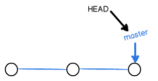
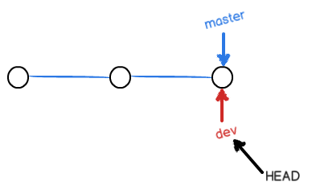
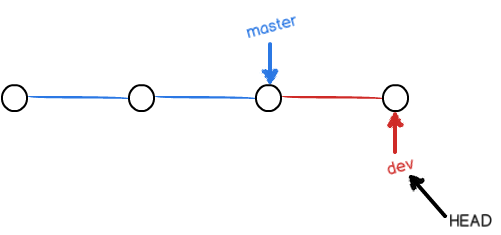
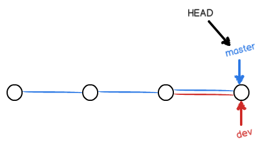
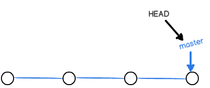
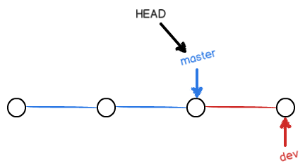

# GitLearn

* ```shell
  $ git init
  ```
  将当前目录初始化为git可以管理的仓库。

* ```shell
  $ git add <文件名>
  ```
  讲文件或更改文件添加到暂存区。

* ```shell
  $ git commit -m "提交描述"
  ```
  将暂存区内容提交至仓库分支（默认为主分支（master））。

* ```shell
  $ git status
  ```
  该命令可以让我们时刻掌握仓库当前的状态。比如有文件被修改等，但是不能看到具体修改内容。

* ```shell
  $ git diff <文件名>
  ```
  查看文件修改内容（在git add之前调用有效)

* ```shell
  $ git log [--pretty=oneline] 
  ```
  查看提交记录，【】中参数为每个记录显示一行。

* ```shell
  $ git reset --hard HEAD^
  ```
  * 回到上一个版本。**版本回退**
  * HEAD代表当前版本，HEAD^代表前一个版本，HEAD^^代表前第二个版本，，，。 HEAD～100前第一百个版本。
  * 撤回到最新版本的方法：
    * 如果命令窗口还存在提交的命令，可以找到提交时的commit id ，可以这样恢复：
      ```shell
      $ git add readme.txt
      $ git commit -m "append GPL"
      [master 3628164] append GPL
       1 file changed, 1 insertion(+), 1 deletion(-)
       -----------------------------------------------------
      $ git reset --hard 3628164
      ```
    * ```shell
      $ git reflog
      ```
      该命令将显示所以操作记录，如下：
      ```shell
      $ git reflog
      ea34578 HEAD@{0}: reset: moving to HEAD^
      3628164 HEAD@{1}: commit: append GPL
      ea34578 HEAD@{2}: commit: add distributed
      cb926e7 HEAD@{3}: commit (initial): wrote a readme file
      ```
      然后再通过`$ git reset --hard <commit id>`进行恢复。

* ```shell
  git checkout -- <文件名>
  ```
  该命令意思是，把某文件在工作区的修改全部撤销，这
  里有两种情况：
  * 一种是某文件自修改后还没有被放到暂存区，现在，撤销修改就回到和版本库一模一样的状态；
  * 一种是某文件已添加到暂存区后，又做了修改，现在，撤销修改就回到添加到暂存区后的状态。
  * 总之，就是让这个文件回到最后一次`$ git commit`或者`$ git add`时的状态。
  * 该命令中的 -- 很重要，没有 -- ，就变成了“切换到另一个分支”的命令，我们后面的分支管理中会再次遇到`$ git checkout`命令。

* ```shell
  $ git reset HEAD <文件名>
  ```
  该命令可以把暂存区的修改撤销掉（unstage），重新放回工作区：
  ```shell
  $ git reset HEAD readme.txt
  Unstaged changes after reset:
  M       readme.txt
  ```

* ####修改内容总结
  * 场景1：当你改乱了工作区某个文件的内容，想直接丢弃工作区的修改时：
    * ```shell
      $ git checkout -- <file name>
      ```
  * 场景2：当你不但改乱了工作区某个文件的内容，还添加到了暂存区时，想丢弃修改，分两步，第一步使用命令
    * ```shell
      git reset HEAD <file name> //回退到场景1
      ```
    * 第二步按场景1操作。
  * 场景3：已经提交了不合适的修改到版本库时，想要撤销本次提交，必须进行版本回退。前提是：没有推送到远程库。

* ####删除文件
  * 工作区文件删除:`$ rm filename`

    * 版本库删除:`$ git rm filename`

    * 提交更改:`$ git commit -m "删除描述"`
      ---
  * 撤销文件删除
    * ```shell
      $ rm filename
      ```
    * ```shell
      $ git checkout -- filename
      ```
  * 注释：git checkout 其实是用版本库里的版本替换工作区的版本，无论工作区是修改还是删除，都可以“一键还原”。

* ####生成ssh key
  由于你的本地git仓库和github仓库之间的传输是通过ssh加密的，所以需要生成并设置秘钥。
  * 生成秘钥：
  ```shell
  $ ssh-keygen -t rsa -C "youremail@example.com"
  ```
  ​	你需要把邮件地址换成你自己的邮件地址，然后一路回车，使用默认值即可，由于这个Key也不是用于军事目的，所以也无需设置密码。

  ​	如果一切顺利的话，可以在用户主目录里找到`.ssh`目录，里面有`id_rsa`和`id_rsa.pub`两个文件，这两个就是SSH Key的秘钥对，`id_rsa`是私钥，不能泄露出去，`id_rsa.pub`是公钥，可以放心地告诉任何人。
  * 设置秘钥
    ​	将`id_rsa.pub`文件中的内容设置到`github`账号的`SSH Keys` 。

    ​	为什么GitHub需要SSH Key呢？因为GitHub需要识别出你推送的提交确实是你推送的，而不是别人冒充的，而Git支持SSH协议，所以，GitHub只要知道了你的公钥，就可以确认只有你自己才能推送。

* ####git本地仓库与github仓库关联
  创建github仓库
  * 创建本地仓库并关联github仓库
    ```shell
    $ echo "# learngit" >> README.md
    $ git init
    $ git add README.md
    $ git commit -m "first commit"
    $ git remote add origin https://github.com/ShawnFeiyu/learngit.git
    $ git push -u origin master
    ```
  * 关联本地仓库到github仓库
    ```shell
    $ git remote add origin https://github.com/ShawnFeiyu/learngit.git
    $ git push -u origin master
    ```
    ​        把本地库的内容推送到远程，用`git push`命令，实际上是把当前分支`master`推送到远程。
    ​        由于远程库是空的，我们第一次推送`master`分支时，加上了`-u`参数，Git不但会把本地的`master`分支内容推送到远程新的`master`分支，还会把本地的`master`分支和远程的`master`分支关联起来，在以后的推送或者拉取时就可以简化命令了：
  ```shell
  $ git push origin master
  ```
  ​        推送成功后，可以立刻在Github页面中看到远程库的内容已经和本地一模一样。

* ####从远程库克隆
  ```shell
  $ git clone https://github.com/ShawnFeiyu/learngit.git
  ```
  该命令直接将仓库下载下来，即文件夹learngit。

* ####git修改远程仓库地址
  方法有三中：
  * 修改命令
    ```shell
    $ git remote set-url origin [url]
    Eg.
    $ git remote set-url origin git@github.com:ShawnFeiyu/learngit.git
    ```
  * 先删后加
    ```shell
    $ git remote rm origin
    $ git remote add origin [url]
    ```
  * 直接修改config文件

* ####远程仓库总结
  git支持多种协议，包括https，但通过ssh支持的元素git协议速度最快。
  ***SSH警告待解决***。

* ####分支管理

  > 分支在实际中有什么用呢？假设你准备开发一个新功能，但是需要两周才能完成，第一周你写了50%的代码，如果立刻提交，由于代码没写完，不完整的代码库会导致别人不能干活了。如果等代码全部写完再一次提交，又存在丢失每天进度的巨大风险。

  > 现在有了分支，就不用怕了。你创建了一个属于自己的分支，别人看不到，还继续在原来的分支上正常工作，而你在自己的分支上干活，想提交就提交，直到开发完毕后，再一次性合并到原来的分支上，这样既安全，又不影响别人工作。

  > 其他版本控制系统如SVN等都有分支管理，但是用过了之后你会发现，这些版本控制系统创建和切换分支比蜗牛还慢，简直让人无法忍受，结果分之功能成了摆设，大家都不去用。

  > 但git的分支是与众不同的，无论创建、切换和删除分支，git在1秒钟之内就能完成！无论你的版本库是1个文件还是1万个文件。

  在版本回退里，你已经知道，每次提交，git都把它们串成一条时间线，这条时间线就是一个分支。截止到目前，只有一条时间线，在git里，这个分支叫主分支，即`master`分支。`HEAD`才是指向提交的，所以，`HEAD`指向的就是当前分支。

  一开始的时候，`master`分支是一条线，git用`master`指向最新的提交，再用`HEAD`指向`master`，就能确定当前分支，以及当前分支的提交点：

  

  每次提交，`master`分支都会向前移动一步，这样，随着你不断提交，`master`分支的线也越来越长。

  当我们创建新的分支，例如`dev	`时，git新建了一个指针叫`dev`，指向`master`相同的提交，再把`HEAD`指向`dev`，就表示当前分支在`dev`上：

  

  你看，git创建一个分支很快，因为除了增加一个`dev`指针，改改`HEAD`的指向，工作区的文件都没有任何变化！

  不过，从现在开始，对工作区的修改和提交就是针对`dev`分支了，比如新提交一次后，`dev`指针往前移动一步，而`master`指针不变：

  

  假如我们在`dev`上的工作完成了，就可以把`dev`合并到`master`上。git怎么合并呢？最简单的方法，就是直接把`master`指向`dev`的当前提交，就完成了合并：

  

  所以git合并分支也很快！就改改指针，工作区内容也不变！

  合并完分支后，甚至可以删除`dev`分支。删除`dev`分支就是把`dev`指针删掉，删掉后，我们就剩下了一条`master`分支：

  

  * 创建分支

    ```shell
    $ git checkout -b dev
    Switched to a new branch 'dev'
    ```

    `git checkout`命令加上`-b`参数表示创建并切换，相当于以下两条命令：

    ```shell
    $ git branch dev
    $ git checkout dev
    Switched to branch 'dev'
    ```

    然后，用`git branch`命令查看当前分支：

    ```shell
    $git branch
    * dev
      master
    ```

    `git branch`命令会列出所有分支，当前分之前会标一个`*`号。

    然后，我们就可以在`dev`分支上正常提交，比如对readme.md做个修改，加上一行：

    ```shell
    Creating a new branch is quick.
    ```

    然后提交：

    ```shell
    $ git add readme.txt 
    $ git commit -m "branch test"
    [dev fec145a] branch test
     1 file changed, 1 insertion(+)
    ```

    现在，`dev`分支的工作完成，我们就可以切换回`master`分支：

    ```shell
    $ git checkout master
    Switched to branch 'master'
    ```

    切换回`master`分支后，再查看一个readme.md文件，刚才添加的内容不见了！因为那个提交是在`dev`分支上，而`master`分支此刻的提交点并没有变：

    


  * 合并分支

    现在，我们把`dev`分支的工作成果合并到`master`分支上：

    ```shell
    $ git merge dev
    Updating d17efd8..fec145a
    Fast-forward
     readme.txt |    1 +
     1 file changed, 1 insertion(+)
    ```

    ​

* ####标签管理

* ​

